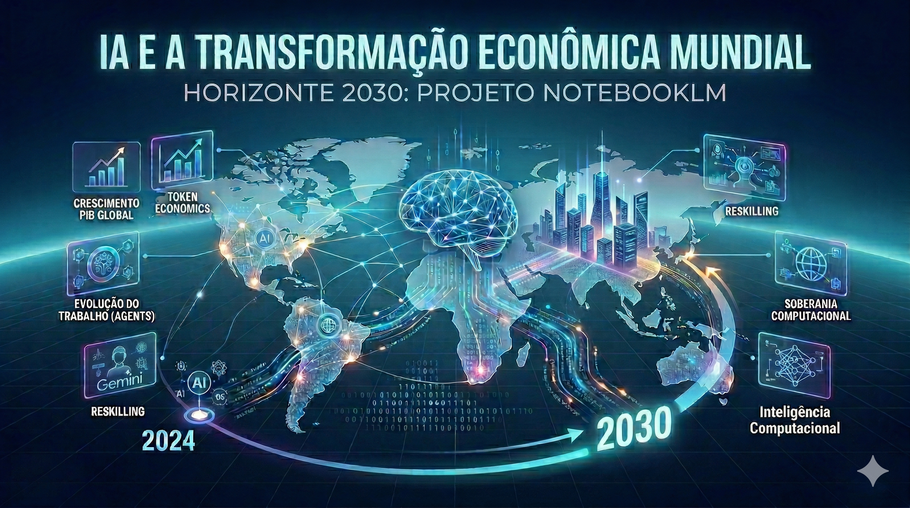

# 🌐 IA e a Transformação Econômica Mundial: Horizonte 2030

## 📋 Sobre o Projeto
Este repositório apresenta um estudo estratégico sobre como a Inteligência Artificial reconfigurará a economia global até o ano de **2030**. O projeto foi desenvolvido utilizando o **NotebookLM** da Google como ferramenta de análise, síntese e curadoria de fontes de alto valor.

Este trabalho explora a intersecção entre inovação tecnológica, produtividade e impactos socioeconômicos, consolidando o uso de IAs generativas como ferramentas de aprendizagem ativa.

> [!IMPORTANT]
> **Acesse o Trabalho Consolidado no NotebookLM:**  *[https://l1nk.dev/8fy0gou]*

---

## 🎯 Objetivos de Estudo
* **Análise de Produtividade:** Projetar o crescimento do PIB mundial impulsionado pela automação inteligente.
* **Transformação do Mercado:** Identificar as competências necessárias para o profissional de tecnologia em 2030.
* **Soberania e Ética:** Estudar os riscos de desigualdade digital e a geopolítica da IA.

## 📚 Curadoria de Fontes Estratégicas
A base de conhecimento foi estruturada em três pilares fundamentais para garantir uma visão 360º do tema:

### 1. Relatórios e Análises de Mercado (Dados Quantitativos)
* **McKinsey Global Institute:** *The economic potential of generative AI (2023).*
* **FMI (IMF):** *Gen-AI: Artificial Intelligence and the Future of Work.*
* **Goldman Sachs:** *The Potentially Large Effects of AI on Economic Growth.*

### 2. Perspectivas Literárias e Geopolíticas (Visão Crítica)
* **Kai-Fu Lee:** Obra *AI Superpowers* - Foco na competição global e na automação total de tarefas repetitivas.
* **Yuval Noah Harari:** Obras *21 Lessons for the 21st Century* e *Homo Deus* - Reflexões sobre o "desemprego tecnológico" e a nova classe social digital.

### 3. Mídias Multimodais e Conteúdo Digital (Transformações Tecnológicas)
* **Entrevistas e Podcasts:** Transcrições de diálogos com líderes como Sam Altman (OpenAI) e Jensen Huang (NVIDIA).
* **Fórum Econômico Mundial:** Painéis sobre a Agenda 2030 e a transição para a economia da IA.
* **Portais Especializados:** Curadoria de artigos da *MIT Technology Review* e *TechCrunch*.

## 🧠 Engenharia de Prompts (Cicatrizes)
O processo de "troubleshooting" e refinamento das respostas da IA foi documentado para demonstrar maturidade técnica:

| Cenário | Prompt Estratégico | Aprendizado (Cicatriz) |
| :--- | :--- | :--- |
| **Síntese Cruzada** | "Cruze os dados de produtividade da McKinsey com a visão de Kai-Fu Lee sobre a simbiose humano-IA." | Inicialmente a IA focou apenas em números. Precisei forçar a análise do fator humano para obter profundidade. |
| **Simulação de Cenário** | "Crie um debate entre Harari e analistas do FMI sobre a renda básica universal em 2030." | A IA tendia ao otimismo excessivo. Foi necessário ajustar o prompt para incluir os riscos éticos citados nas fontes. |
| **Glossário Técnico** | "Extraia os termos mais frequentes nos vídeos do YouTube sobre 'AI Sovereignty'." | Aprendi que termos de entrevistas são mais atuais que os de livros de 5 anos atrás. |

## 📖 Miniguia de Estudo (Consolidado)

### 🧩 Resumos Estruturados
* **A Era dos Agentes:** Até 2030, a IA deixará de ser uma ferramenta de chat para se tornar um agente autônomo de execução.
* **Aceleração Econômica:** Ganhos de até 7% no PIB mundial são esperados, mas dependem da infraestrutura de hardware (GPU) e energia.

### 📒 Glossário Temático
* **Token Economics:** A nova unidade de valor baseada no custo de processamento de dados.
* **Dataism (Harari):** A crença de que o universo consiste em fluxos de dados e que o valor de qualquer entidade depende da sua contribuição para o processamento de dados.
* **Human-AI Symbiosis (Kai-Fu Lee):** O modelo onde a IA realiza o trabalho analítico e os humanos focam na estratégia, criatividade e empatia.

### 🛠️ Prompts Reutilizáveis para Revisão
* *"Atue como um analista econômico sênior. Cruze os dados das fontes e crie um cenário comparativo entre economias avançadas e emergentes (como o Brasil) quanto ao risco de deslocamento de mão de obra até 2030"*
* *"Resuma a posição de Harari sobre a evolução do trabalho humano frente à AGI."*

---
✨ *Projeto desenvolvido por Felipe Martiniano da Silva, para o desafio de projeto da DIO.*
